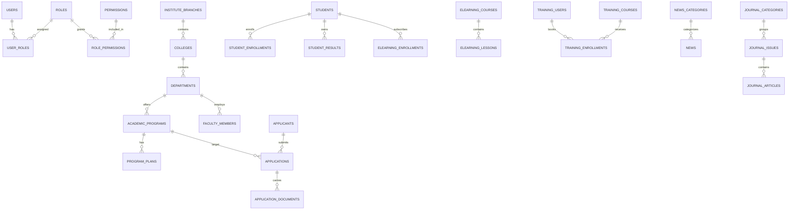
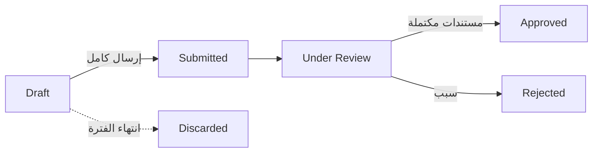

# Software Requirements Specification — NIAS Website

**المعهد الوطني للعلوم الإدارية — اليمن**
إعادة بناء الموقع الرسمي (nias-ye.academy)

| البند | القيمة |
|---|---|
| الوثيقة | Software Requirements Specification |
| الإصدار | 1.0 (Draft — متوحد من مراحل 1→19) |
| الحالة | للمراجعة قبل بدء التنفيذ |
| التقنيات | Node.js + Express.js، JavaScript (React + Vite)، PostgreSQL، REST API |
| اللغة | عربية + مصطلحات تقنية إنجليزية؛ ثنائية اللغة ar/en مع RTL/LTR |

> مرجعيات التصنيف عبر الوثيقة: ✅ **Confirmed** (متحقق من الفحص الفعلي) · ⚠ **Inferred** (استنتاج منطقي) · 🆕 **Proposed** (تصميم مقترح) · ❓ **Unknown** (غير قابل للفحص).

---

## 1. Project Overview

الموقع الحالي للمعهد الوطني للعلوم الإدارية (صنعاء، تأسس 1963) مبني بـ PHP CMS مخصص (`index.php?page=...`) بمعرّفات MD5. المشروع إعادة بناء كاملة بالنظام المواصفات أدناه مع **الحفاظ على الهوية البصرية والأقسام والوظائف الموجودة**، وإضافة بوابات (طالب/متدرب/إدارة) بنظام RBAC كامل. العمل تم وفق مراحل يقودها المستخدم، مع التزام صارم بقواعد: الفحص الفعلي لا التخمين، تمييز Confirmed/Inferred/Proposed/Unknown، ثبات أسماء الكيانات، وعدم كتابة كود دون أمر صريح.

## 2. Scope

**In-Scope:**
- الموقع العام (محتوى، أخبار، برامج، كليات، مؤتمرات، مجلة، تدريب).
- بوابتا الطالب والمتدرب (بنهاية مؤكدة من الموقع الأصلي: نتائج + تعليم إلكتروني / تسجيل + دخول).
- نظام قبول إلكتروني كامل (من الصفر — غير موجود الآن إلكترونياً).
- لوحة إدارة (CMS) لكل محتوى الموقع العام.
- نظام مجلة علمية (محررون).
- RBAC، أمان، SEO، Accessibility (WCAG 2.1 AA قدر الإمكان)، اختبارات، نشر Docker.

**Out-of-Scope (الأولوية المؤجلة):**
- دفوعات إلكترونية/محفظة (لا توجد إشارة دفع في الموقع).
- LMS عميق (واجبات/نقاش/تصحيح آلي).
- تطبيقات جوال أصلية.
- التكامل مع أنظمة PHP القديمة الداخلية.

## 3. Stakeholders

- إدارة المعهد والكليات والأقسام (مالكون للقرار والمحتوى).
- مكتب القبول والتسجيل، مكتب التدريب.
- هيئة التدريس، الطلاب، المتدربون، الجمهور (الزوار).
- فريق التطوير (مختصون) — المطوّر القديم: Bootstrap Yemen.
- مزوّد الاستضافة (المعلمات الحالية PHP — انظر المخاطر).

## 4. Users (أدوار النظام)

| الدور | الحالة | المصدر |
|---|---|---|
| Guest | ✅ Confirmed | كل الصفحات العامة |
| Student | ✅ Confirmed (الدخول) / 🆕 المحتوى الداخلي | /sdm — رقم أكاديمي + كلمة مرور؛ الداخل ❓ |
| Trainee | ✅ Confirmed (تسجيل + دخول) | نموذج كامل + دخول بالهاتف؛ الداخل ❓ |
| Faculty | ⚠ صفحة فقط (قائمة فارغة) | لا login → دور النظام 🆕 |
| Employee | 🆕 Proposed | لا portal حالي |
| Admission Officer | 🆕 Proposed | لا back-office حالي |
| Training Officer | 🆕 Proposed | لا back-office مرئي |
| Content Editor | ✅ للمجلة (لوحة admin_magazines) / ⚠ الموقع الرئيسي | جزئي مؤكد |
| Journal Editor | ✅ Confirmed (المجلة) | admin_magazines |
| Administrator | ⚠ Inferred | بنية CMS |

## 5. Site Map

```
HOME
├── عن المعهد (dean / الهيكل التنظيمي / ...)
├── الكليات والفروع (11 كلية / 6 فروع)
├── البرامج الأكاديمية (13 برنامجاً)
├── القبول (عرض برامج الآن — تطبيق إلكتروني مقترح)
├── أعضاء هيئة التدريس (فارغة حالياً)
├── الأخبار والفعاليات والأنشطة
├── المؤتمرات (بيانات تجريبية مرئية)
├── التدريب والتأهيل (عرض + بوابة التدريب)
├── المجلة العلمية (أرشيف + هيئة التحرير)
├── مركز التحميل (معطل حاليًا)
├── معرض الصور
├── اتصل بنا
└── بوابات
    ├── بوابة الطلاب /sdm (نتائج + تعليم إلكتروني)
    ├── بوابة التدريب (تسجيل متدرب + دخول)
    └── لوحة الإدارة (جديدة)
```

## 6. Pages

تحليل 22 صفحة (المرحلة 2) بنمط Page → Function → Data → API → DB Entity. أمثلة رئيسية:

| الصفحة | النوع | API المقابل |
|---|---|---|
| الرئيسية (Hero+أخبار+إحصاءات+تدريب) | Listing/Content | GET /news (featured), /programs, /training/courses |
| عن المعهد / العميد / الهيكل | Content | GET /pages/:slug |
| الكليات والفروع | Listing | GET /colleges, /colleges/:id |
| البرامج / تفاصيل البرنامج | Listing/Detail | GET /programs, /programs/:id |
| القبول | Form (مقترح) | POST /admission/applications |
| الأخبار / تفاصيل | Listing/Detail | GET /news, /news/:id |
| المؤتمرات | Listing | GET /conferences |
| أعضاء هيئة التدريس | Listing | GET /faculty-members |
| المجلة / العدد | Listing/Detail | GET /journal/issues, /journal/articles/:id |
| الدورات التدريبية | Listing | GET /training/courses |
| اتصل بنا | Form | POST /contact-messages |
| بوابات الطالب/المتدرب/الإدارة | Portal | (الأقسام 17–19) |

## 7. Functional Requirements

| ID | المتطلب |
|---|---|
| FR-01 | تصفح المحتوى العام ثنائي اللغة والبحث بالأخبار |
| FR-02 | عرض البرامج والكليات والفروع وأعضاء الهيئة والخطط PDF |
| FR-03 | إرسال رسالة اتصال (التحقق والحد) |
| FR-04 | تسجيل حساب متدرب (الاسم الرباعي/الفرع/الهاتف/CAPTCHA/توقيع رقمي) |
| FR-05 | دخول موحّد حسب identifier (رقم أكاديمي/هاتف/بريد) + نسيت/إعادة كلمة المرور |
| FR-06 | بوابة الطالب: نتائج + ملف + مقررات تعليم إلكتروني (مقيدة به) |
| FR-07 | بوابة المتدرب: دورات + تسجيل + طلباتي + شهادات (مقترح) |
| FR-08 | تقديم طلب قبول إلكتروني (Stepper) + مستندات + تتبع بالـ ref_code + مراجعة المسؤول |
| FR-09 | CMS: إدارة Pages/News/Events/Programs/Colleges/Faculty/Downloads/Media بعمليات C+R+U+D+Publish+Unpublish |
| FR-10 | لوحة إدارة: Dashboard/إحصائيات/أقدم أنشطة/إشعارات + شاشات Admission/Training/Users/Roles/System |
| FR-11 | إدارة المجلة: تصنيفات/أعداد/مقالات/هيئة تحرير وعن النشر |
| FR-12 | RBAC كامل (أدوار→أذونات) مع فرض في Backend فقط |
| FR-13 | سجل تدقيق (audit_logs) لكل عمليات CUD/نشر/مراجعة/دخول |
| FR-14 | استرجاع كلمة المرور عبر token آمن مرّة واحد صالح 1h |
| FR-15 | تحميل ملفات آمن بـ Magic check + حدود حجم |

## 8. Non-Functional Requirements

| NFR | المتطلب |
|---|---|
| الأداء | TTFB < 2s لصفحات عامة (p95)؛ SPA خفيفة؛ فهارس (GIN/btree) للقوائم |
| تعدد المستخدمين | آلاف قراء عام + مئات جلسات بوابة (مخطط بسيط قابل للنطاق) |
| التوفر | 99.5% أهداف التوقيت؛ healthz + إعادة تشغيل تلقائية |
| الأمان | OWASP Top 10 معالجة (القسم 16)؛ zero-trust default |
| قابلية الاستخدام | WCAG 2.1 AA قدر الإمكان (القسم 23) |
| الصيانة | طبقات Routes→Controller→Service→Repository→DB؛ لا Business Logic في Routes |
| ثنائية اللغة | ar/en كاملة مع RTL/LTR وتخطيط عكسي |
| القابلية للنشر | Docker Compose + بيئة staging قبل prod |

## 9. UI/UX Requirements

- **الهوية المحفوظة (مؤكد من CSS):** primary `#009B77`، dark `#007d60`، accent `#d4af37`، تدرج Nav `#004d40→#00695c`، Hero `#2c3e50`، Footer `#1c1c1c`، أزرار Pill (50px)، خطوط Cairo/Poppins، أيقونات FontAwesome.
- **Responsive:** نقاط كسر (5000/1600/1400/1340/1140/1023/767/599/479) + إصلاحات إلزامية: إزالة `user-scalable=0`، أهداف ≥24px، عدم تقليل الخط إلى 8px.
- **RTL/LTR:** logical properties + bidi isolation + swap للاتجاه عند تبديل اللغة.
- **إصلاح ملاحظات Stage 3 (Confirmed):** روابط ميتة غير تُرث، بيانات متضاربة (إحصاءات 4900/1500) تُحسب ديناميكياً، ترجمة إنجليزية ناقصة تُكمل.

## 10. Workflows

| السير | البند / الحالة | Actor | خلاصة |
|---|---|---|---|
| القبول | 🆕 Proposed | Applicant→Officer | Stepper → submitted → under_review (مستندات مكتملة) → approved/rejected (سبب) |
| الطالب | ✅ دخول/ نتائج/تعليم إلكتروني؛ الداخل 🆕 | Student | login → ملف → نتائج (فصل) → مقررات → تقدم 0–100 |
| التدريب | ✅ تسجيل/دخول؛ الباقي 🆕 | Trainee→TO | إنشاء حساب → دخول هاتف → تسجيل دورة (pending) → confirm/in_progress/completed → شهادة (مقترح) |
| CMS | ✅ مجلة؛ الموقع ⚠ | Editor→Admin | draft → publish؛ unpublish → draft؛ كل عملية audit |

## 11. Database

- **الاختيار:** PostgreSQL (عوامل ENUM/checks/JSONB ولاحق S3-friendly).
- **الأساس (36 جدولاً — Migration 001):** users/roles/permissions/role_permissions/user_roles · institute_branches/colleges/departments/faculty_members · academic_programs/program_plans · applicants/applications/application_documents · students/student_enrollments/student_results/student_documents · elearning_courses/elearning_lessons/elearning_enrollments · training_users/training_courses/training_enrollments · site_pages/news_categories/news/gallery_items/download_files/conferences/contact_messages/trustees · journal_categories/journal_issues/journal_articles/journal_editorial_board.
- **إصلاحات/إضافات Additive (Migrations 003–007):** refresh_tokens، password_reset_tokens، site_settings، audit_logs، trainers، training_attendance، training_certificates، media_library، admission_periods، عمود `ref_code` في applications، عمود `category` في training_courses.
- **قرارات:** Events داخل news (`content_type` enum) · soft-delete (`deleted_at`) للمحتوى والمستخدمين · timestamps `created_at/updated_at` بترقيع auto · ENUM لكل statuses · فهارس GIN للبحث النصي.
- الأسماء **ثابتة** منذ المرحلة 2 (قاعدة 8/9 — لا تغيير دون سبب موثّق).

## 12. ERD



## 13. API

- Base `/api/v1`؛ JWT Bearer؛ `Accept-Language`؛ Standard shapes:

```json
{ "success": true, "data": { }, "meta": { "page": 1, "limit": 10, "total": 42 } }
{ "success": false, "message": "...", "error": { "code": "...", "details": [] } }
```

- Error Codes: VALIDATION_ERROR(400) UNAUTHORIZED(401) FORBIDDEN(403) NOT_FOUND(404) CONFLICT(409) RATE_LIMITED(429) INTERNAL_ERROR(500).
- Constructor: مصفوفة CRUD (L/D/C/U/X) لكل الموارد (branches, colleges, departments, programs, program-plans, faculty-members, news, news-categories, pages, gallery, downloads, conferences, trustees, training courses/users/enrollments, students, student-results, elearning courses/lessons/enrollments, users, roles, permissions, contact-messages, journal issues/articles/categories/editorial-board) + Domain endpoints الخاصة (auth، admission، training register/enroll، dashboard، notifications…).

## 14. Authentication

- `POST /auth/login` بتوجيه identifier (رقم أكاديمي→Student، هاتف→Trainee، بريد→لوحة) + bcrypt + Rate Limit 5/دقيقة ولا تمييز رسائل (anti-enumeration).
- Access JWT (15m، يحمل roles+permissions) + Refresh (7d، SHA-256 مخزن، **Rotation**، Revoke عند logout).
- Cookie HttpOnly+Secure+SameSite=Strict لـ Refresh.
- `forgot/reset-password`: token crypto 32 بايت، hash، صالح 1h، مرة واحدة، إبطال كل الجلسات عند إعادة الضبط.
- الإصدار لا يعتمد على الحسابات المتساوم intكلمة بلا credential: التوجيع عبر جداول مرتبطة.

## 15. Authorization (RBAC)

```
users 1─* user_roles *─1 roles 1─* role_permissions *─1 permissions
```
- Enforcement **Backend فقط** عبر `authenticate` + `requirePermission(code)` + فحص Ownership (الطالب/المتدرب/العضو على سجلاته).
- الأدوار (10) مصفوفة الصلاحيات (اختصار): رؤية عامة للجميع؛ النتائج/المقررات للطالب؛ التسجيلات للمتدرب؛ تعديل ملفه للعضو؛ اللوحة لـ Employee+؛ القبول/التدريب لضباطها؛ المحتوى للمحررين؛ المجلة لمحررها؛ الكل للـ Admin.

## 16. Security

| الخطر | الإجراء (مختصر) |
|---|---|
| SQL Injection | Parameterized فقط (pg) — لا string concat |
| XSS | تعقيم HTML خادمي + CSP + escape تلقائي |
| CSRF | Bearer header + SameSite=Strict |
| Brute Force | Rate limits متدرجة (login/register/contact/admission) |
| Password | bcrypt 12 + سياسات قوة + reset آمن |
| File Upload | Magic check + امتدادات بيضاء + حدود (صور2MB/PDF10MB) + تخزين خارج webroot + re-encode (sharp) |
| Access Control | RBAC + Ownership + Least-Privilege |
| CORS | Whitelist env |
| HTTPS | TLS 1.2+ + HSTS |
| Cookies | HttpOnly/Secure/SameSite |
| Headers | helmet كامل |
| Secrets | env فقط + تدوير + لا commit |
| Audit Logs | append-only بدون بيانات حسّاسة |

> **تنبيه:** لم يُجرَ اختبار اختراق على الموقع الأصلي — لا يُزعم وجود أو غياب ثغرات فيه.

## 17. Admin Dashboard

وحدات: Dashboard (Statistics/Recent Activities/Notifications) · Content (News/Events/Pages/Downloads) · Academic (Colleges/Departments/Programs/Faculty/Students/Courses/Results) · Admission (Applications/Documents/Approval/Rejection) · Training (Programs/Trainees/Registrations) · Users (Users/Roles/Permissions) · System (Settings/Audit Logs). كل شاشة (UI/API/DB/Permissions/CRUD) موثقة في المرحلة 12.

## 18. Student Portal

- ✅ Confirmed: دخول بـ /sdm (رقم أكاديمي)، نظامان: **نتائج الطلاب** + **التعليم الإلكتروني**.
- شاشات الأساس (تطبيق): Dashboard (خلاصة Data مؤكدة) · Profile (بيانات إدارية) · Courses (مقيدة فقط + Progress 0–100) · Results (فلترة فصل).
- ★ Recommended: Documents · Notifications (+ جدول محاضرات/شهادة/دفع مقررات — تحت الموافقة).
- الملاحظ: الداخل بعد login ❓ لم يُفحص — التصميم مقترح.

## 19. Training Portal

- ✅ Confirmed: نموذج تسجيل المتدرب (4 أجزاء/فرع/هاتف/CAPTCHA/توقيع رقمي) · دخول بالهاتف + نسيت كلمة المرور · عرض الدورات.
- 🆕 Proposed: لوحة المتدرب/My Courses/Enrollment/طلباتي · Trainers (جدول جديد) · Attendance (مؤجل عمداً) · Certificates (كود فريد + صفحة تحقق عامة) · Reports (مشتقة).
- القرار: الشهادات والـ attendance تتطلب اعتماداً إضافياً قبل البناء — القاعدة "لا وظيفة غير مؤكدة إلا Recommended".

## 20. Admission

- ✅ Confirmed في الموقع: جدول 13 برنامجاً + Modal عرض + **لا تطبيق إلكتروني** (كل الحالات Offline).
- 🆕 Proposed: admission_periods (نوافذ زمنية/سعة) · Applicant/Application (ref_code للتتبع) · Program Selection · Documents (رفع إلزامي) · Review · Approval/Rejection (سبب إجباري) · Statuses.



## 21. CMS

- Workbench واحد (List + Editor RTL ثنائي اللغة + Preview) لـ Pages/News/Events(داخل News)/Programs/Colleges/Faculty/Downloads/Media.
- عمليات الست لجميع الأنواع: Create/Read/Update/Delete(Soft)/Publish/Unpublish (`status` + `published_at`).
- 🆕 tables إضافية: `media_library` (مصدر واحد للصور) · `site_settings`.
- Publish خلف `published` فقط للجمهور؛ كل عملية ellaaudit_logs.

## 22. SEO

- Meta Title/Description فريدة لكل صفحة (ar/en حسب Accept-Language) · Canonical بالـ slug النهائي · Sitemap.xml مولّد في build (مع lastmod) · Robots.txt (disallow /student /trainee /admin /uploads) · Open Graph/تويتر · JSON-LD (EducationalOrganization، WebSite+SearchAction، BreadcrumbList، NewsArticle، Course، Event).
- اعتبار SPA: إدارة Head بمكتبة SPA + خيار prerender/SSR للصفحات العامة (قرار في التنفيذ).

## 23. Accessibility (WCAG 2.1 AA)

- Semantic HTML (h1 واحد/هرم h2–h3 محفوظ في RT المحقن) · Keyboard (skip-link، Focus Trap في Modal، ترتيب طبيعي) · Focus visible (outline 2px) · Alt-text إلزامي + زخرفي فارغ · Labels صريحة + روابط أخطاء (`aria-describedby`) · Contrast (استخدام dark `#007d60` للنصوص على خلفية ملونة؛ نص AA) · RTL/LTR logical + bidi · Target ≥24px · عكس rezize 200/400% · فحص بـ axe/Lighthouse في CI (مرحلة 17/18).

## 24. Testing

| الطبقة | الأدوات | الأمثلة |
|---|---|---|
| Unit | Vitest | Services/Validators/Utils (auth routing، transitions، hash، slug…) |
| Integration | Supertest + PG test | API contracts/آخر Ownership/RBAC/429 · Migrations up-down · قيود فريدة · Soft delete · Refresh rotation |
| E2E | Playwright | Login، Admission، Training Registration، Student Portal، Admin |
| UI | Playwright viewports | Mobile 375 / Tablet 768 / Desktop 1440–1920 × RTL/LTR؛ axe |

- القواعد: DB اختبار خاص + seeds `@test`؛ CI Gates (unit→integration→E2E→a11y/SEO).

## 25. Deployment

- **تم إنشاؤه (بموافقة):** `infra/Dockerfile` (multi-stage, non-root, healthcheck) · `infra/docker-compose.yml` (db+migrate+api+nginx) · `infra/nginx.conf` (TLS/HSTS/static+/api//uploads) · `.env.example` · `backup.sh` (pg_dump يومي + احتفاظ 30) · `.dockerignore`.
- HTTPS عبر Let's Encrypt؛ DNS وTLS نهائي pendenteا (النطاق «لاحقاً»).
- **تكوين الاستضافة:** المعلمة الحالية PHP — تنبيه: Docker/Node لا يدعم عادةً shared PHP؛ النشر يتطلب VPS (خطر #1).
- النسخ: pg_dump ليلاً + نسخة خارجية + اختبار استعادة شهري (مرحلة 6).
- CI/CD: build → migrations up (one-shot) → rolling restart → /healthz → rollback.

## 26. Risks

| # | الخطر | الأثر | التخفيف |
|---|---|---|---|
| 1 | استضافة PHP الحالية لا تدعم Node/Docker | فشل النشر كما صُمم | قرار VPS/ترقية عند مرحلة النشر |
| 2 | نطاق نهائي/تخزين لم يُحسم | تأخير DNS/TLS | قرار �نسه من المستخدم |
| 3 | المحتوى الحقيقي غير متاح (أخبار/كليات/خطط PDF/مدير أعضاء) | قوائم فارغة عند الإطلاق | تخطيط استيراد/إدخال CMS؛ أخطاء Placeholder محجوبة |
| 4 | بوابات الداخلية ❓ لم تُفحص | افتراضات داخل التصميم | فصل مؤكد/مقترح؛ إيصال للعميل |
| 5 | قنوات إرسال (بريد/SMS) للننسية/الإشعارات غير متاحة | تعطل forgot-password/إشعارات | عزل إمكانية القناة في env؛ بدائل مؤقتة |
| 6 | بيانات إحصائية متضاربة بالموقع الأصلي | أرقام خاطئة | عدادات ديناميكية من DB |
| 7 | تبنّي إداري للـ CMS الجديد | محتوى قديم/عدم استخدام | تدريب موجز + واجهة مألوفة |
| 8 | Scope الزحف (LMS/دفع/جوال) | تضخم التسليم | تجميد Out-of-Scope |
| 9 | أمان النشر العام (نظام حكومي) | اختراق | القسم 16 + مراجعة اختبار قبل الإطلاق |
| 10 | توفّر الملف الرسمي (ترخيص/رابط) | SEO/هوية ناقصة | حواجز ملكية تُعبأ قبل الإطلاق |

## 27. Unknowns (مفتوحة)

- محتوى البوابات الداخلية بعد تسجيل الدخول (طالب/متدرب/مجلة/لوحة).
- المحتوى الحقيقي للكليات/البرامج/الأخبار/المؤتمرات والخطط PDF.
- بيانات أعضاء هيئة التدريس (القائمة فارغة).
- أرقام الإحصاءات الموثوقة (تعارض 4900/1500).
- تفاصيل «مركز التحميل» المعطل ووظائفه المطلوبة.
- سلوك لوحة محرر المجلة الفعلي (admin_magazines).
- بيئة الاستضافة النهائية/نطاق/تخزين الملفات.
- توفر بريد/SMS لقنوات الإشعارات.
- انطلاق الرسالة الرسمية القديمة (ورقي) لحالات القبول.

## 28. Implementation Plan

| Phase | المخرج | الاعتماد | الدخول إلى |
|---|---|---|---|
| P0 | scaffold `server/` (Express+pg) + تشغيل Migrations 001–007 + healthz + `.env` | موافقة المستخدم (مرحلة 20 ترسل) | مدخل أول |
| P1 | Backend core: auth+Rbac، public APIs (فرع/كلية/برامج/أخبار/تدريب عرض)، خطأ قياسي | P0 | |
| P2 | Frontend العام (Vite+React): التخطيط العام + صفحات النشاط + SEO | P1 (API) | |
| P3 | البوابة الطالب + التدريب + القبول (UI/API) | P2 | |
| P4 | Admin Dashboard + CMS (editor/Publish/Media) | P3 | |
| P5 | المجلة + التنبيهات/الإشعارات + تحسين الأقسام | P4 | |
| P6 | حماية (16)/SEO(22)/Accessibility(23)/Testing(18) كاملة | P1–P5 | |
| P7 | Docker تنشيط staging + امتلاء محتوى مورد حقيقي + مراجعة + إطلاق | كل السابق | |

**Gates بين كل مرحلة:** مراجعة المستخدم + اختبارات الطبقة المعنية + عدم تجاوز (لا ميزة خارج المرحلة).